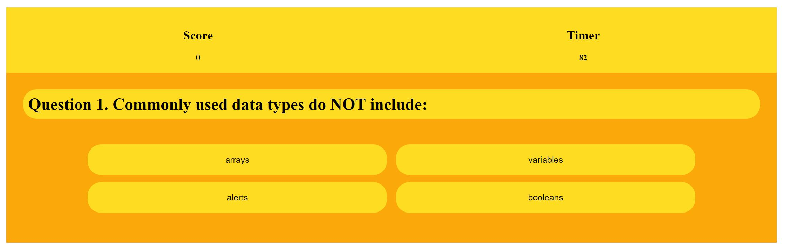

# Coding-Quiz

## Welcome to Coding Quiz!

In this repository you will find index.html file, script.js and style.css that were used to create this application. 
HTML was used to create the foundation for this application and CSS was used to make it look like a game :)  
The "brain" that makes it work was created with Javascript. DOM was also applied to make the code more functional and efficient.  
Should any suggestions be made, I will be more than happy to bring any improvements in this code.

### The structure of the application

The quiz is presented in a question - answer format, where the user is given 10 questions testing their basic Javascript knowledge.

- <em> all questions and answers were generated using array, each answer choice is a button with an event listener tied to it. </em> 

The user is also given 2min 30secs to complete the quiz, each correct answer grants 5 points and each wrong answer will result in deducting 15secs from total time.
 
- <em>setInterval() method was used to run the timer when the first question is presented, and with the last question the timer stops. If the user runs out of time before the last question they are not able to complete the quiz.</em> 

Every time the user answers the question - the application will let them know whether their answer is correct or wrong.

- <em> every time the user clicks on their selected choice the text appears indicating whether the choice was correct or not</em> 

The user is able to track the time as it is shown on the webpage, as well as their current score.

- <em> the score counter increments by 5 with every correct answer</em> 

Once the quiz is completed or user runs out of time, the user is able to view their final score and save it alongside with their initials

- <em> localStorage() method is used to store user's initials and score in their browser memory</em> 

If the user decides to start over they can do so by refreshing the page.
 

### Credits
<em><strong> the data for the questions in this quiz was taken from the provided mock-up and W3Schools Javascript quiz</strong></em> (https://www.w3schools.com/quiztest/quiztest.asp?qtest=JS) 

#### The screenshot of deployed application

##### The link to deployed application
